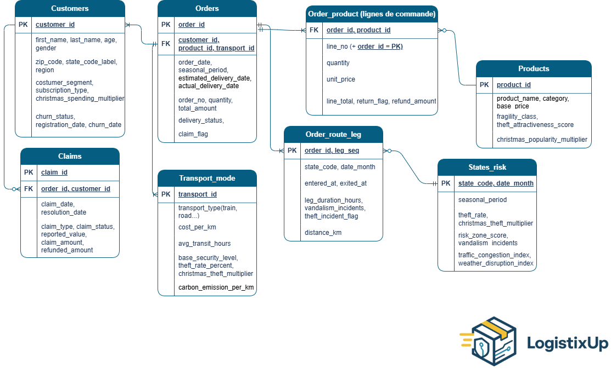

# LogistixUp - Dashboard Analytics

Dashboard Streamlit pour analyser et visualiser les données logistiques et transport en temps réel.

---

## À propos de l'app
**LogistixUp** est une application web interactive dédiée au pilotage des performances logistiques et à l’analyse des **risques opérationnels**.  
Elle permet de visualiser les indicateurs clés, d’analyser les tendances de transport et de suivre les réclamations clients, afin d’identifier les zones, périodes et canaux les plus exposés au risque.

**Fonctionnalités principales :**

✅ Dashboard multipage avec Streamlit  
✅ Visualisations interactives  
✅ Données cloud depuis Google Drive  
✅ Téléchargement automatique des données  
✅ Déploiement Docker simplifié  
✅ Interface user-friendly et épurée 

---

## Prérequis

| Outil | Vérifier |
|-------|----------|
| **Git** | `git --version` |
| **Docker Desktop** | `docker --version` |
| **docker-compose** | `docker-compose --version` |

---

##  Installation (3 étapes!)

```bash
# 1. Cloner le projet
git clone https://github.com/HanaT-DS/streamlit_dashboard_v1.git
cd streamlit_dashboard_v1

# 2. Lancer l'app
./scripts/launch.sh
# ou
bash scripts/launch.sh

# 3. Ouvrir dans le navigateur
http://localhost:8501
```

**C'est tout!**

##  Arrêter l'app

```bash
# Dans le terminal:
Ctrl+C

# Ou 
docker-compose down
```

---

## Scripts disponibles

### **launch.sh**  (À UTILISER!)
```bash
./scripts/launch.sh
```
**Rôle:** Lance l'app complète
- Vérifie Docker
- Télécharge les données depuis Google Drive
- Lance le dashboard sur http://localhost:8501

**Utiliser à chaque fois que tu veux lancer l'app!**

---

### **data_getter.sh** 
```bash
bash scripts/data_getter.sh
```
**Rôle:** Télécharge les données depuis Google Drive
- Récupère 8 fichiers CSV
- Les sauvegarde dans le dossier `./data/`

**Utiliser si:** Tu veux mettre à jour les données manuellement

---

## Structure du projet

```
streamlit_dashboard_v1/
│
├── test1.py                    # App principale Streamlit
├── Dockerfile                  # Configuration Docker
├── docker-compose.yml          # Orchestration Docker
├── requirements.txt            # Dépendances Python
├── README.md                   # Ce fichier
│
├── scripts/
│   ├── launch.sh              # Lance l'app (À UTILISER!)
│   └── data_getter.sh         # Télécharge les données
│
├── data/                       # Données (auto-téléchargées)
│   ├── claims.csv
│   ├── customers.csv
│   ├── orders.csv
│   ├── products.csv
│   └── ... (4 autres fichiers)
│
├── pages/                      # Pages Streamlit
│    
│
├── assets/                     # Images, logos & CSS
│ 
│
└── .streamlit/                 # Configuration
    └── config.toml           
```

---

## Données utilisées

L'app utilise **8 fichiers CSV** téléchargés automatiquement:




---

## Auteurs

**Hana Talbi**
- GitHub: [@HanaT-DS](https://github.com/HanaT-DS)


---
